<style>
/* 1. CONFIGURAZIONE GENERALE */
section {
    font-size: 25px; 
    text-align: left;      /* Testo normale a sinistra */
    padding-top: 50px;     /* Spazio in alto */
}

/* 2. CONFIGURAZIONE TITOLI */
h1, h2, h3 {
    text-align: left;    /* Titoli centrati per tutte le slide */
    width: 100%;
}

/* 3. CONFIGURAZIONE SPECIFICA PER LA COPERTINA (LEAD) */
section.lead {
    text-align: center;    /* Centra tutto il testo */
    justify-content: center; /* Centra verticalmente */
}
/* Nella copertina i titoli devono essere grandi */
section.lead h1 { font-size: 60px; margin-bottom: 0.2em;}
section.lead h2 { font-size: 40px; margin-bottom: 1em; color: #aaa;}

/* 4. UTILITY: COLONNE E BOX */
.columns {
  display: grid;
  grid-template-columns: repeat(2, minmax(0, 1fr));
  gap: 1rem;
  align-items: center; /* Centra verticalmente le colonne tra loro */
}

.box-rosso {
    background-color: #800000;
    color: white;
    padding: 20px;
    border-radius: 10px;
    border-left: 5px solid red;
    box-shadow: 5px 5px 10px rgba(0,0,0,0.5);
}

.box-codice {
    background-color: #133;
    border: 4px solid #555;
    padding: 15px;
}
.hljs-code-div .hljs-line:not(.hljs-highlight) {
    opacity: 0.15 !important; 
    filter: blur(1px); 
}

.hljs-code-div .hljs-highlight {
    background-color: rgba(255, 255, 255, 0.1);
    display: block;
}

pre, code { font-size: 18px; }
ul, ol { margin-left: 20px; }
</style>

# N-body gravitational problem
## Computational Physics Project


**Lorenzo Rizzi**
Modern computing for physics @ Physics of Data
January 2026

<br>

<div class="columns">
<div>

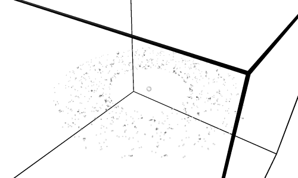

</div>
<div>

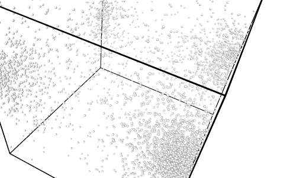

</div>
</div>

---

## The physical problem

<div class="columns">
<div>

Fix $N$. The gravitational interaction at time $t$ reads:

$$\vec{F}_i = G \sum_{j \neq i}^N \frac{m_i m_j}{|\vec{r}_{ij}|^3} \vec{r}_{ij}$$

Requiring $O(N^2)$ computations per iteration.

To avoid numerical instabilities, one usually introduces a **softening** $\epsilon$:

$$\frac{1}{(r^2 + \epsilon^2)^{3/2}}$$

We will use $G = 1, \epsilon = 10^{-1}$

</div>
<div>

<br>

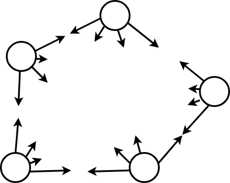

</div>
</div>

---

## Index

The code was realized in three distinct implementations:

1. **Sequential CPU**: one-threaded *reference line*.
2. **Parallel CPU**: using OpenMP enabling multi-threading.
3. **Parallel GPU**: hardware acceleration with CUDA-C.

<br>

**In this presentation:**

* Energy conservation analysis (using either Euler or Verlet scheme)
* Physically relevant properties (radial distribution)
* Performance comparaison between implementations and benchmarking

---

## Energy conservation: integration schemes

<br>
<br>

<div class="columns">
<div>

### 1. Euler (Explicit)

The simplest approach, but **not symplectic**. Energy drifts with time (explodes), spurious injection!

$$
\begin{aligned}
\vec{x}_{t+1} &= \vec{x}_t + \vec{v}_t \Delta t \\
\vec{v}_{t+1} &= \vec{v}_t + \vec{a}(\vec{x}_t) \Delta t
\end{aligned}
$$

<br>

**Bad for orbital mechanics**:
The potential is not well behaved.
Particles spiral out due to energy gain.

</div>
<div>

### 2. Velocity Verlet

**Symplectic** integrator. Reversible in time, conserves energy for long periods.

$$
\begin{aligned}
\vec{v}_{t+\frac{1}{2}} &= \vec{v}_t + \frac{1}{2}\vec{a}_t \Delta t \\
\vec{x}_{t+1} &= \vec{x}_t + \vec{v}_{t+\frac{1}{2}} \Delta t \\
\vec{a}_{t+1} &= F(\vec{x}_{t+1}) / m \\
\vec{v}_{t+1} &= \vec{v}_{t+\frac{1}{2}} + \frac{1}{2}\vec{a}_{t+1} \Delta t
\end{aligned}
$$

**Standard for N-Body**:  Stable orbits over time

</div>
</div>

---

## Energy conservation

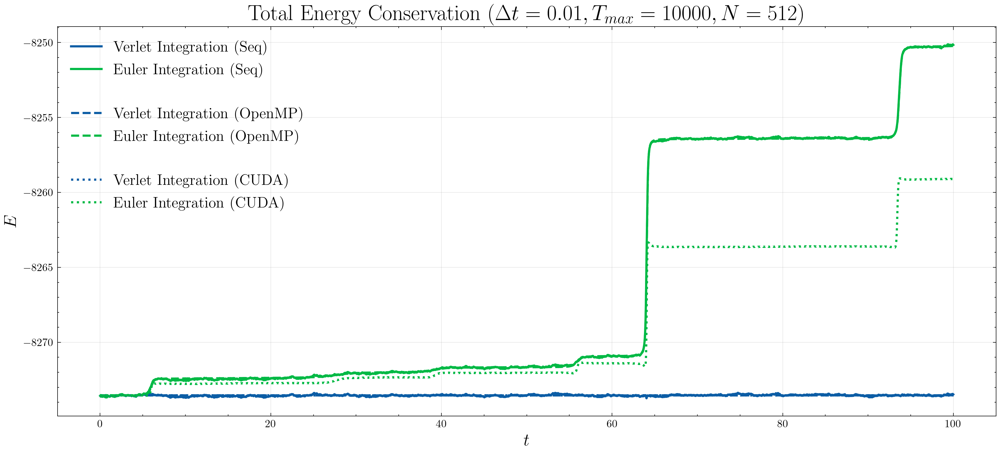

---

## Energy conservation

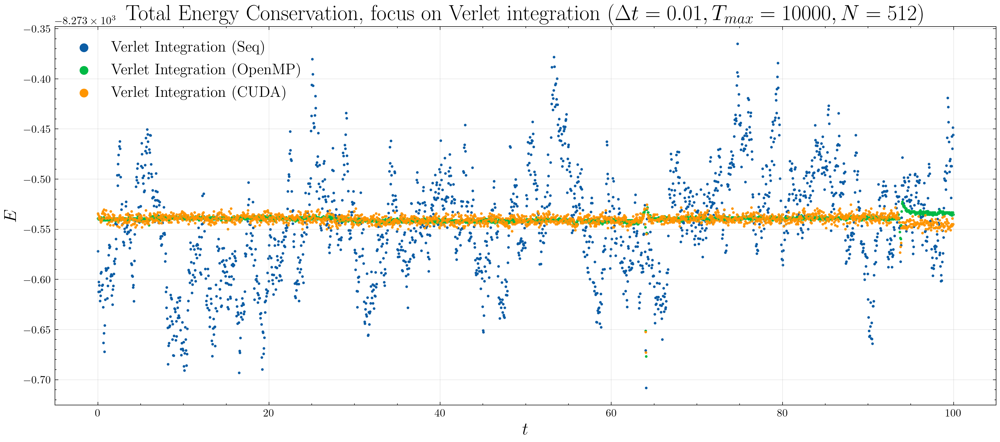

---

## Sanity check: two-bodies orbital dynamics
<style scoped>
/* Trasforma l'immagine in un blocco e imposta i margini automatici ai lati */
img {
    display: block;
    margin: 0 auto;
}
</style>
<br>

<div class="columns">
<div>

A special initial condition, where $N = 2$:

$m_1 \gg m_2$

$\vec v_1 \approx 0,\>\>  \vec v_2 = v \hat u_z$

$\vec r_1 = 0, \>\> \vec r_2 = (L/2, 0, 0)$

A symplectic integrator (Verlet) should always oscillate aroung the analytical trajectory!

</div>
<div>


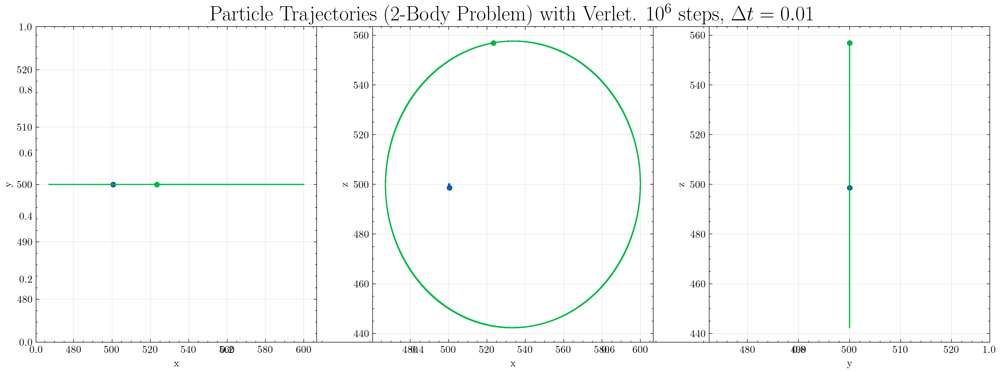


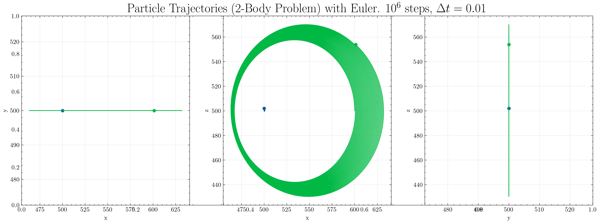
</div>
<div>


---

## Virial theorem
<style scoped>
img {
    display: block;
    margin: 0 auto;
}
</style>
If the total enery of the system is negative, then it should converge to a stationary state where the virial theorem holds true. In particular, at **equilibrium**, one expects to see:
$$
2 \langle K \rangle = - \langle U \rangle
$$
Given the total energy constraint $\langle K \rangle + \langle U \rangle = E$, then, if we wait long enough, we should measure: $
K \approx - E, 
U \approx 2E
$

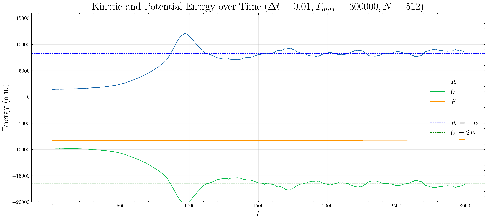

---

## Radial distribution function

<br>

<style scoped>
/* Trasforma l'immagine in un blocco e imposta i margini automatici ai lati */
img {
    display: block;
    margin: 0 auto;
}
</style>
<br>

<div class="columns">
<div>

When the initial condition is random (provided $E < 0$), all the bodies will collaps and form a dense cluster

With OVITO, we can extract the frame-by-frame radial distribution function $g(r)$:


Theoretical models (isothermal sphere) predicts a scaling behavior $\rho(r) \sim g(r) \sim r^{-2}$
</div>
<div>


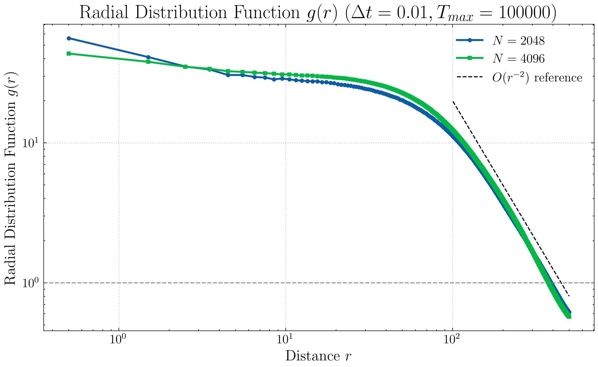

</div>
<div>

---

## Code structure (CPU sequential)

The entire code is written in C++. A main class is defined `Simulation`:

```cpp
class Simulation {
    private:
    int m_N;        
    Real m_dt;          
    Real m_L;            
    // Fundamental data structures
    std::vector<Real> m_x, m_y, m_z;      
    std::vector<Real> m_vx, m_vy, m_vz;    
    std::vector<Real> m_fx, m_fy, m_fz;    
    std::vector<Real> m_mass;  

    public:
    // Constructor (random masses, velocities, positions); implememented in simulation.cpp
    Simulation(int n_particles, Real timeStep, Real length);
    Simulation(Real timeStep, Real length);
    ...

    // Crucial part, computes the forces (implemented in computeForces.cpp)
    Real computeForces(bool);

    // The numerical integrators (choose which to use in main; implemented in numericalIntegrator.cpp)
    void integrateEuler(int nSteps, int saveEvery, std::string saveEnergy, std::string saveTrajectory);
    void integrateVerlet(int nSteps, int saveEvery, std::string saveEnergy, std::string saveTrajectory);
};
```
The sequential logic flow is quite easy: while $t < T_{max}$, call `computeForce()` and run the numerical integration. Energy is computed along with the forces

---

## Code structure: OpenMP

We will use OpenMP to run the simulation in a multi-threaded fashion.


<div class="columns">
<div>

The public method `integrateEuler/Verlet()` is called once. 

A team of threads is spawned and will last until the end of main loop (minimizing overhead due to thread creation/destruction)

</div>
<div>

```cpp {3}
void Simulation::integrateEuler(int n_steps, int saveEvery, ...) {
    // ...
    int time = 0; Real kineticEnergy = 0.0; Real potentialEnergy = 0.0;
=== #pragma omp parallel shared(time, kineticEnergy, potentialEnergy)
    {
        while (time < n_steps) {
            Real partialPotentialEnergy = this->computeForce(isSavingStep); 
            #pragma omp for schedule(static)
            for (int i = 0; i < m_N; ++i) {
                // Update positions and velocities (Euler or Verlet)
            }

            if (isSavingStep) {
                #pragma omp for schedule(static) reduction(+:kineticEnergy)
                for (int i = 0; i < m_N; ++i) {
                    Real v2 = m_vx[i]*m_vx[i] + m_vy[i]*m_vy[i] + m_vz[i]*m_vz[i];
                    kineticEnergy += 0.5 * m_mass[i] * v2;
                }
                #pragma omp atomic
                potentialEnergy += partialPotentialEnergy;
            }
            #pragma omp barrier
            #pragma omp master
            {
                time++; kineticEnergy = 0.0; potentialEnergy = 0.0;
            }
            #pragma omp barrier
        }
    }
}

```

</div>
</div>


--- 
## Code structure: OpenMP

We will use OpenMP to run the simulation in a multi-threaded fashion.


<div class="columns">
<div>

Now each thread calls `float computeForces(bool)` where a nested `pragma omp for` will tell the threads to only consider a subset of the whole particles set (note the static scheduling!)

If needed, we also compute the (partial) potential energy and return it (private to each thread)


An implicit barrier is there

</div>
<div>

```cpp {3}
Real Simulation::computeForces(bool calcEnergy) {
    Real potentialEnergy = 0.0;
    #pragma omp for schedule(static)
    for (int i = 0; i < m_N; ++i) {
        // Extract the position of particle i
        Real xi = m_x[i]; Real yi = m_y[i]; Real zi = m_z[i];
        for (int j = 0; j < m_N; ++j) {
                if (i == j) continue; 
                Real dx = m_x[j] - xi;
                Real dy = m_y[j] - yi;
                Real dz = m_z[j] - zi;

                Real r2 = dx*dx + dy*dy + dz*dz + 1e-2f; 
                Real dist = std::sqrt(r2);
                Real f_mag = (m_mass[i] * m_mass[j]) / (r2 * dist);
                fxi += f_mag * dx; fyi += f_mag * dy; fzi += f_mag * dz;
                
                if (calcEnergy) {
                    ui_local -= 0.5 * (m_mass[i] * m_mass[j]) / dist;
                }
            }

        m_fx[i] = fxi; m_fy[i] = fyi; m_fz[i] = fzi;

        potentialEnergy += ui_local;
    }    
    return potentialEnergy;
}
```

</div>
</div>

---


## Code structure: OpenMP

We will use OpenMP to run the simulation in a multi-threaded fashion.


<div class="columns">
<div>

Subsequently, each thread performs the numerical integration on its assigned subset of particles.


This is a $O(N)$ operation, do we really need to parallelize it?

No (when $N$ is large). But threads are alive, so there's no point in not doing it + data locality

</div>
<div>

```cpp {3}
void Simulation::integrateEuler(int n_steps, int saveEvery, ...) {
    // ...
    int time = 0; Real kineticEnergy = 0.0; Real potentialEnergy = 0.0;
    #pragma omp parallel shared(time, kineticEnergy, potentialEnergy) 
    {
        while (time < n_steps) {
            Real partialPotentialEnergy = this->computeForce(isSavingStep); 
=========== #pragma omp for schedule(static)
            for (int i = 0; i < m_N; ++i) {
                // Update positions and velocities (Euler or Verlet)
            }

            if (isSavingStep) {
                #pragma omp for schedule(static) reduction(+:kineticEnergy)
                for (int i = 0; i < m_N; ++i) {
                    Real v2 = m_vx[i]*m_vx[i] + m_vy[i]*m_vy[i] + m_vz[i]*m_vz[i];
                    kineticEnergy += 0.5 * m_mass[i] * v2;
                }
                #pragma omp atomic
                potentialEnergy += partialPotentialEnergy;
            }
            #pragma omp barrier
            #pragma omp master
            {
                time++; kineticEnergy = 0.0; potentialEnergy = 0.0;
            }
            #pragma omp barrier
        }
    }
}
```
</div>
</div>

---

## Code structure: OpenMP

We will use OpenMP to run the simulation in a multi-threaded fashion.


<div class="columns">
<div>

If we want to save the step:
1) Compute kinetic energy (`#pragma omp for reduction`)
2) Sum up local potential energies (`#pragma omp atomic`). 
</div>
<div>

```cpp {3}
void Simulation::integrateEuler(int n_steps, int saveEvery, ...) {
    // ...
    int time = 0; Real kineticEnergy = 0.0; Real potentialEnergy = 0.0;
    #pragma omp parallel shared(time, kineticEnergy, potentialEnergy) 
    {
        while (time < n_steps) {
            Real partialPotentialEnergy = this->computeForce(isSavingStep); 
            #pragma omp for schedule(static)
            for (int i = 0; i < m_N; ++i) {
                // Update positions and velocities (Euler or Verlet)
            }

=========== if (isSavingStep) {
                #pragma omp for schedule(static) reduction(+:kineticEnergy)
                for (int i = 0; i < m_N; ++i) {
                    Real v2 = m_vx[i]*m_vx[i] + m_vy[i]*m_vy[i] + m_vz[i]*m_vz[i];
                    kineticEnergy += 0.5 * m_mass[i] * v2;
                }
                #pragma omp atomic
                potentialEnergy += partialPotentialEnergy;
            }
            #pragma omp barrier
            #pragma omp master
            {
                time++; kineticEnergy = 0.0; potentialEnergy = 0.0;
            }
            #pragma omp barrier
        }
    }
}
```
</div>
</div>

---

## Code structure: OpenMP

We will use OpenMP to run the simulation in a multi-threaded fashion.


<div class="columns">
<div>

1) Another barrier to synch

2) A single thread will reinitialize global shared variables

3) Another barrier, all threads will wait to master

</div>
<div>

```cpp {3}
void Simulation::integrateEuler(int n_steps, int saveEvery, ...) {
    // ...
    int time = 0; Real kineticEnergy = 0.0; Real potentialEnergy = 0.0;
    #pragma omp parallel shared(time, kineticEnergy, potentialEnergy) 
    {
        while (time < n_steps) {
            Real partialPotentialEnergy = this->computeForce(isSavingStep); 
            #pragma omp for schedule(static)
            for (int i = 0; i < m_N; ++i) {
                // Update positions and velocities (Euler or Verlet)
            }

        if (isSavingStep) {
            #pragma omp for schedule(static) reduction(+:kineticEnergy)
            for (int i = 0; i < m_N; ++i) {
                Real v2 = m_vx[i]*m_vx[i] + m_vy[i]*m_vy[i] + m_vz[i]*m_vz[i];
                kineticEnergy += 0.5 * m_mass[i] * v2;
            }
            #pragma omp atomic
            potentialEnergy += partialPotentialEnergy;
        }
        #pragma omp barrier
======= #pragma omp master
        {
            time++; kineticEnergy = 0.0; potentialEnergy = 0.0;
        }
        #pragma omp barrier
        }
    }
}
```
</div>
</div>

---
## What to benchmark?

<br>


```cpp
Simulation sim(nParticles, dt, L);
auto start = std::chrono::high_resolution_clock::now();
sim.integrateVerlet(nSteps, nSteps, "", ""); // Don't save to IO!
auto end = std::chrono::high_resolution_clock::now();
std::chrono::duration<double> elapsed = end - start;
```


We repeat the simulation $15$ times and record the minimum execution time to filter out transient OS background noise. Disk writing is disabled during benchmarking.

<div class="columns">
<div>

### System Specifications
| Feature | Specification |
| :--- | :--- |
| **Processor** | AMD Ryzen™ 7 7730U |
| **Architecture** | Zen 3 (8C / 16T) |
| **Clock Speed** | 2.0 GHz (4.5 GHz Boost) |
| **L3 Cache** | 16 MB Shared |

</div>
<div>

### Compilation Config
The code was compiled using **GCC (g++)** with aggressive optimization settings:

* `-O3 -march=native -ffast-math -fopenmp`

</div>
</div>

---

## OpenMP benchmarking

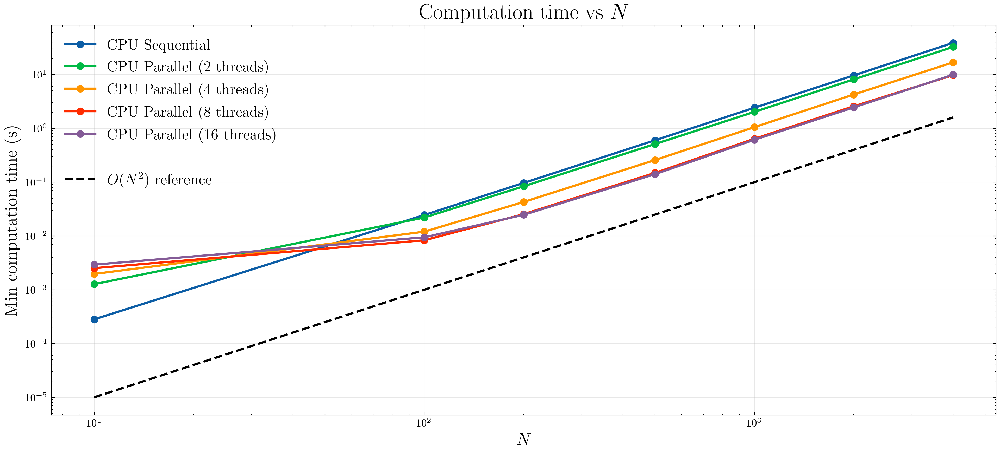

---

## OpenMP speedup

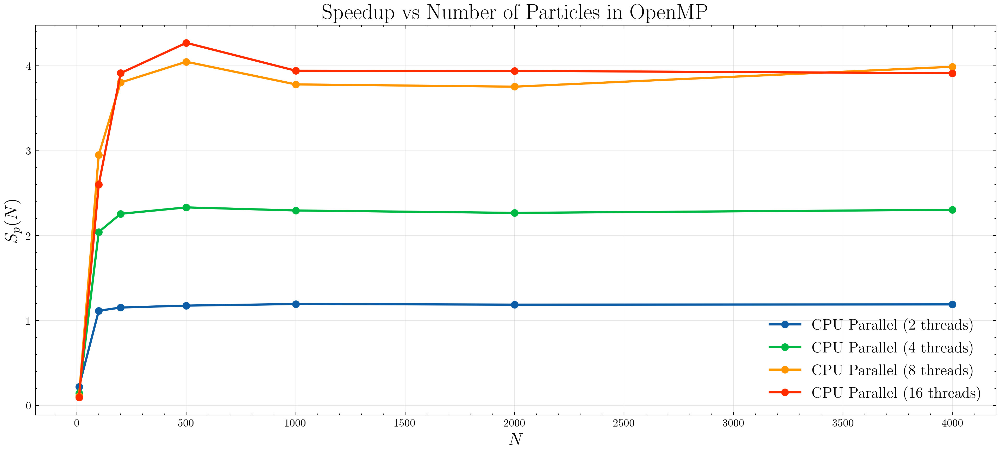

Efficiency of $50\%$ ... Why? We are not leveraging Newton's third law!

---

## OpenMP

<div class="columns">
<div>

```cpp
Real Simulation::computeForces(bool calcEnergy) {
    Real potentialEnergy = 0.0;
    #pragma omp for schedule(static)
    for (int i = 0; i < m_N; ++i) {
        // Extract the position of particle i
        Real xi = m_x[i]; Real yi = m_y[i]; Real zi = m_z[i];
        for (int j = 0; j < m_N; ++j) {
                if (i == j) continue; 
                Real dx = m_x[j] - xi;
                Real dy = m_y[j] - yi;
                Real dz = m_z[j] - zi;

                Real r2 = dx*dx + dy*dy + dz*dz + 1e-2f; 
                Real dist = std::sqrt(r2);
                Real f_mag = (m_mass[i] * m_mass[j]) / (r2 * dist);
                fxi += f_mag * dx; fyi += f_mag * dy; fzi += f_mag * dz;
                
                if (calcEnergy) {
                    ui_local -= 0.5 * (m_mass[i] * m_mass[j]) / dist;
                }
            }

        m_fx[i] = fxi; m_fy[i] = fyi; m_fz[i] = fzi;

        potentialEnergy += ui_local;
    }    
    return potentialEnergy;
}
```

</div>
<div>

```cpp
Real Simulation::computeForces2(bool calcEnergy) {
    Real potentialEnergy = 0.0;
=== #pragma omp for schedule(dynamic)
    for (int i = 0; i < m_N; ++i) {
        Real xi = m_x[i]; Real yi = m_y[i]; Real zi = m_z[i];
        for (int j = i+1; j < m_N; ++j) { 
            Real dx = m_x[j] - xi;
            Real dy = m_y[j] - yi;
            Real dz = m_z[j] - zi;
            Real r2 = dx*dx + dy*dy + dz*dz + 1e-2f; 
            Real dist = std::sqrt(r2);
            Real f_mag = (m_mass[i] * m_mass[j]) / (r2 * dist);
            fxi += f_mag * dx; fyi += f_mag * dy; fzi += f_mag * dz;
=========== #pragma omp atomic
                m_fx[j] += -f_mag * dx;
                m_fy[j] += -f_mag * dy;
                m_fz[j] += -f_mag * dz;

            if (calcEnergy) {
                ui_local -= 0.5 * (m_mass[i] * m_mass[j]) / dist;
            }
        }

======= #pragma omp atomic
            m_fx[i] += fxi;
            m_fy[i] += fyi;
            m_fz[i] += fzi;
        potentialEnergy += ui_local;
    }    
    return potentialEnergy;
}
```
</div>
</div>

---

## OpenMP + Newton's law performance (not a good idea)

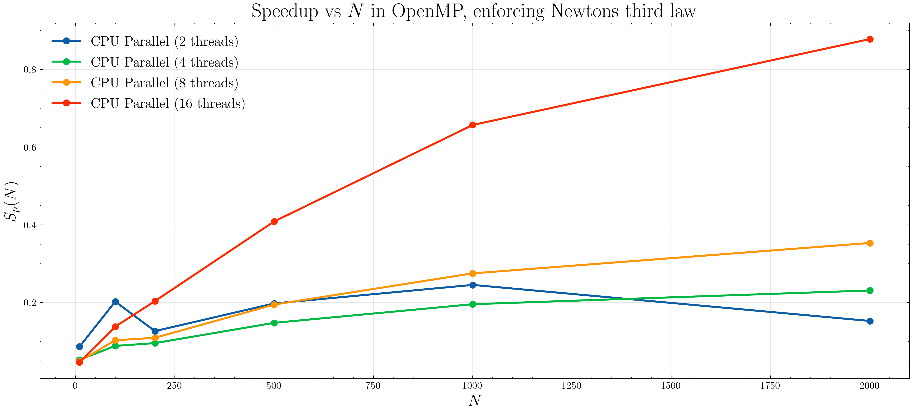

---

## GLOPS
Let us estimate the number of floating point operations per second. Assume:
```cpp
...
// Memory fetching
float dx = m_x[j] - m_x[i];                  (+1)
float dy = m_y[j] - m_y[i];                  (+1)
float dz = m_z[j] - m_z[i];                  (+1)
// Apply Minimum Image Criterion
dx -= m_L * std::round(dx * inv_m_L);        (+2+round)
dy -= m_L * std::round(dy * inv_m_L);        (+2+round)
dz -= m_L * std::round(dz * inv_m_L);        (+2+round)

Real r2 = dx*dx + dy*dy + dz*dz + 1e-2f;         (+7)
Real r = std::sqrt(r2);                          (+sqrt)
Real f_mag = (m_mass[i] * m_mass[j]) / (r2 * r);  (+3)
// Update forces on both i and j
m_fx[i] += f_mag * dx;                           (+2)
m_fy[i] += f_mag * dy;                           (+2)
m_fz[i] += f_mag * dz;                           (+2)
m_fx[j] -= f_mag * dx;                           (+1)
m_fy[j] -= f_mag * dy;                           (+1)
m_fz[j] -= f_mag * dz;                           (+1)
...
```

Hence:
$$
GFLOPS_{serial} \approx \frac{32 N^2 N_{step}}{{\color{red}2}t_{min}\times 10^9}
\>\>\>\>
\>\>\>\>
\>\>\>\>
\>\>\>\>
GFLOPS_{parallel} \approx \frac{29 N^2 N_{step}}{{t}_{min}\times 10^9}
$$

---

## A fair compairason

<br>

<br>

<style scoped>
.columns {
    grid-template-columns: 65% 35%; /* Sinistra larga, Destra stretta */
    gap: 0.5rem;
}
/* Rimpicciolisci il testo della tabella per la colonna stretta */
table { font-size: 18px; width: 100%; }
th, td { padding: 5px; }
p, h3 { font-size: 22px; }
.math { font-size: 20px; }
</style>

<div class="columns">
<div>

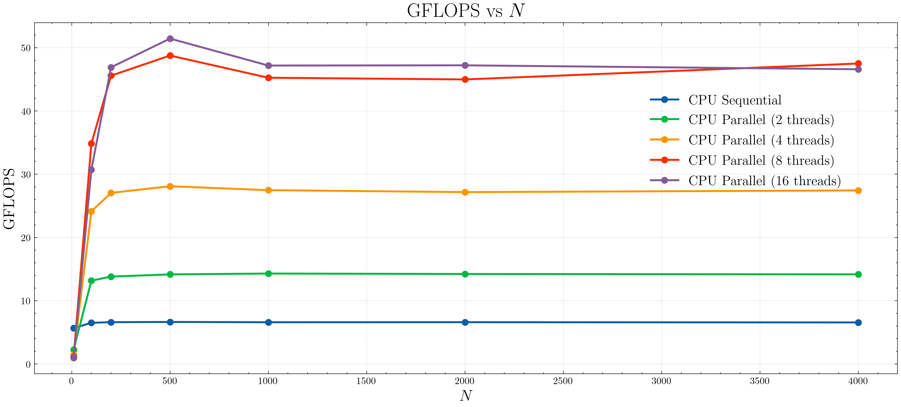

</div>
<div>

### "Speedup" (kinda...)


| Threads | Speedup |
| :---: | :---: | 
| **2** | **2.15x** 
| **4** | **4.17x** 
| **8** | **7.05x** 
| 16 | 7.28x | |

<br>


Efficiency drops after 8 threads (physical cores limit, hyperthreading)


</div>
</div>


---
<style scoped>
code { font-size: 12px; line-height: 1.35; }
.columns { gap: 1.5rem; align-items: start; }
p { font-size: 18px; }
.note { font-size: 16px; color: #666; font-style: italic; margin-top: 10px;}
</style>

## Code Structure: GPU

<div class="columns">
<div>
We introduce pointers (`d_vars`) pointing to GPU memory addresses.

```cpp
class Simulation {
    private:
    // HOST Data (Standard Vectors)
    std::vector<Real> m_x, m_y, m_z;      
    std::vector<Real> m_vx, m_vy, m_vz;    
    std::vector<Real> m_mass;  
    // DEVICE Data (Raw Pointers to VRAM)
    Real *d_x, *d_y, *d_z;
    Real *d_vx, *d_vy, *d_vz;
    Real *d_fx, *d_fy, *d_fz;
    Real *d_mass;
    Real *d_potEnergy, *d_kinEnergy;

    public:
    Simulation(int n, Real dt, Real L);

    void integrateEulerGPU(int nSteps, ...);
    void integrateVerletGPU(int nSteps, ...);
};

```
<p class="note">Convention: <b>m_</b> for Host members, <b>d_</b> for Device pointers.</p>

</div>
<div>
We must allocate VRAM explicitly and move initial data.

<br>

<br>

```cpp
Simulation::Simulation(int n, Real dt, Real L) {

    size_t bytes = m_N * sizeof(Real);

    cudaMalloc(&d_x, bytes);
    cudaMalloc(&d_y, bytes); // ... and so on
    cudaMalloc(&d_vx, bytes);
    cudaMalloc(&d_mass, bytes);
 
    cudaMalloc(&d_fx, bytes);
    cudaMemset(d_fx, 0, bytes);

    cudaMemcpy(d_x, m_x.data(), bytes, cudaMemcpyHostToDevice);
    cudaMemcpy(d_vx, m_vx.data(), bytes, cudaMemcpyHostToDevice);
    cudaMemcpy(d_mass, m_mass.data(), bytes, cudaMemcpyHostToDevice);

}
```

</div>
</div>

<style scoped>
.columns {
    grid-template-columns: 40% 60%; /* Codice più largo */
    gap: 1rem;
}
code { font-size: 15px; } /* Font codice ridotto per farci stare tutto */
p, li { font-size: 20px; }
</style>

---

## Code structure: GPU (Host side)

**Asynchronous Execution:**
The CPU acts as a "commander". It pushes commands (kernels) into a **stream** (Queue) and immediately moves to the next line.

* **Latency Hiding:** The CPU loop runs much faster than the GPU execution.
* **Queueing:** Kernels pile up in the GPU buffer and are executed sequentially.
* **Synch Points:** `cudaMemcpy` (blocking) or `cudaDeviceSynchronize` force the CPU to wait (if we want to save energy)
</div>
<div>

```cpp
void Simulation::integrateEulerGPU(int nSteps, ...) {
    while (time < nSteps) {
        computeForces<<<grid, block>>>(d_x, ...); // <--- KERNEL 1
        eulerKernel<<<grid, block>>>(d_x, ...);   // <--- KERNEL 2
        if (isSavingStep) {
            cudaMemcpy(m_x.data(), d_x, bytes, cudaMemcpyDeviceToHost);
            computeEnergy<<<grid, block>>>(...);      // <--- KERNEL 3
            cudaMemcpy(potEnergy.data(), ...); 
        }
        time++;
    }
    cudaDeviceSynchronize(); 
}
```

---

## Code structure: GPU (device side)

<style scoped>
/* Code font size tuning */
code { font-size: 11px; line-height: 1.2; }
.columns { grid-template-columns: 40% 60%; gap: 1rem; }
p, li { font-size: 18px; }
h3 { font-size: 24px; }
</style>

<br>

**Mapping:** 1 Particle $\Rightarrow$ 1 Thread.

<div class="columns">
<div>

**Key Performance Features:**

1.  **Register Caching:**
    Load `x[i]` and `mass[i]` into local variables reducing memory access. Registers are than global memory.
    
2.  **Fast Math:**
    Usage of `rsqrtf()` instead of standard `1.0/sqrt()`. It's an approximation, but much faster.

3.  **Broadcasting and coalesced memory access**
   All threads in a warp (SIMD-like execution) are synched and are going to request the same particle (one memory transaction). Plus, particles position are contiguous in memory

</div>
<div>

```cpp
__global__ void computeForces(const Real* x, ..., Real* fx, int N, const Real L) {
    int i = blockIdx.x * blockDim.x + threadIdx.x;
    if (i >= N) return; // Bound guard

    Real my_x = x[i]; Real my_y = y[i]; Real my_z = z[i];
    Real my_mass = mass[i]; 
    Real ax = 0.0f; Real ay = 0.0f; Real az = 0.0f; 
    Real half_L = 0.5f * L;

    // Interaction loop
    for (int j = 0; j < N; j++) {

        Real dx = x[j] - my_x;
        Real dy = y[j] - my_y;
        Real dz = z[j] - my_z;

        Real distSqr = dx*dx + dy*dy + dz*dz + 1e-2f; 
        Real invDist = rsqrtf(distSqr); // Hardware accelerated
        Real force = mass[j] * invDist * invDist * invDist;

        ax += force * dx; ay += force * dy; az += force * dz;
    }

    // Write result (coalesced)
    fx[i] = ax * my_mass;
    fy[i] = ay * my_mass;
    fz[i] = az * my_mass;
}
```

---


<style scoped>
table { font-size: 14px; width: 100%; border-collapse: collapse; }
th, td { padding: 4px 6px; border-bottom: 1px solid #ddd; }
code { font-size: 14px; }
.columns { gap: 1rem; align-items: start; }
h3 { font-size: 20px; margin-bottom: 5px; }
p { font-size: 18px; margin-bottom: 10px; }
</style>

## Again, what to benchmark?

<br>


```cpp
Simulation sim(nParticles, dt, L);
auto start = std::chrono::high_resolution_clock::now();

// Inside: kernel launches + cudaDeviceSynchronize() at the very end!
sim.integrateVerletGPU(nSteps, nSteps, 256, "", ""); 

auto end = std::chrono::high_resolution_clock::now();
std::chrono::duration<double> elapsed = end - start;
```

<br>

**Crucial Detail:** CPU and GPU execution is **asynchronous**. The CPU dispatches kernels to the stream and returns immediately. A final `cudaDeviceSynchronize()` inside the function is required to measure the true elapsed time.


<br>


### Device: GPU (Jetson Nano Developer Kit 2GB)
| Feature | Specification |
| :--- | :--- |
| **Arch** | NVIDIA Maxwell |
| **Cores** | 128 (1 SMP) |
| **Memory** | Shared System RAM (2GB) |
| **Compiler** | `nvcc` (`--use_fast_math -O3 `) |


---

## GPU Benchmarking

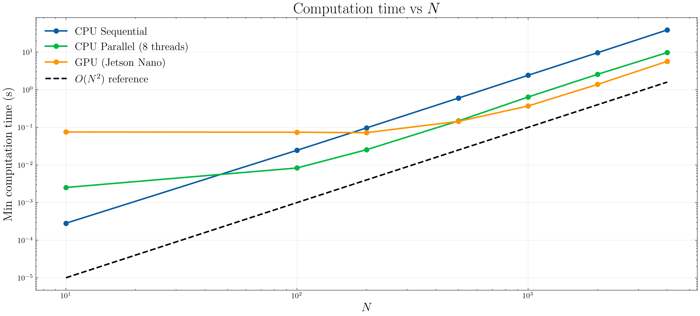

---

## GPU Benchmarking

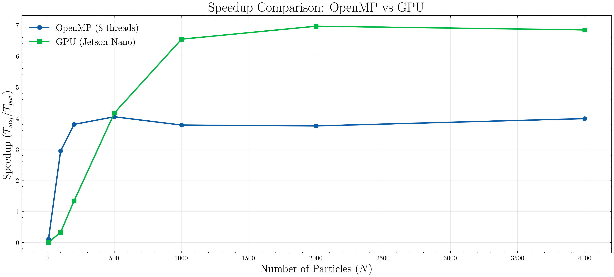

---

## GPU Benchmarking

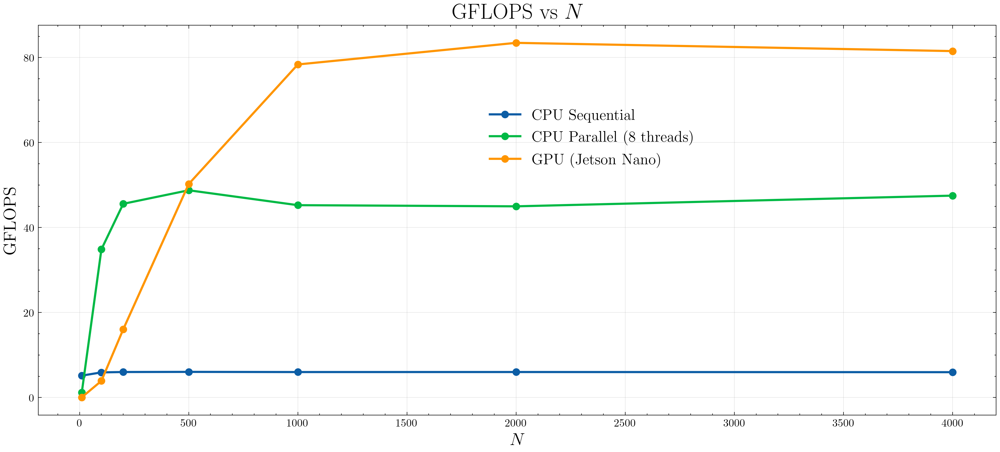

(conservative estimate...)

---

## Memory bandwidth

<style scoped>
/* Ottimizzazione font per densità contenuto */
.columns { gap: 1.5rem; }
p, li { font-size: 19px; margin-bottom: 5px; }
h3 { font-size: 22px; margin-bottom: 10px; }
.math { font-size: 18px; }
</style>


<div class="columns">
<div>

### Performance & Bandwidth
* **Compute:** $\approx 90$ **GFLOPS** ($40\%$ of peak).
    * **14x** speedup vs Sequential CPU.
    * **2x** speedup vs OpenMP (8 threads).
* **Effective Bandwidth:**
    Requesting $4N$ floats ($16$ Bytes) per interaction:
    $$B = \frac{16 N^2 N_{step}}{t_{min}} \approx \mathbf{45 \> GB/s}$$

Theoretical Max Bandwidth is only **25.6 GB/s**.
* It seems impossible we are fetching from DRAM!
* Indeed, for $N=4000$, data fits in the **256 kB L2 Cache**:
    $$4N \cdot 4\text{B} < 256 \text{ kB}$$
    We are exploiting the transparent hardware cache hierarchy.

</div>
<div>

### Can we do better? (Tiling)

To scale beyond the L2 limit ($N > 16k$), we need **Shared Memory**, performing **Tiling:**
1.  Divide particles into blocks ("tiles").
2.  **Cooperative Loading:** Threads in a block collaborate to load a tile from global memory to shared memory *once*.
3.  **Compute:** Perform $N_{tile}$ interactions reading from fast shared memory. Iterate until all blocks have been considered
</div>
</div>


---

<style scoped>
/* Layout denso per codice complesso */
code { font-size: 11px; line-height: 1.3; }
.columns { grid-template-columns: 35% 65%; gap: 1rem; }
p, li { font-size: 17px; }
</style>

## Optimization: Tiling Implementation


```cpp
__global__ void computeForcesTiling(const Real* x, ..., int N, const Real L) {
    int i = blockIdx.x * blockDim.x + threadIdx.x;
    
    Real my_x = (i < N) ? x[i] : 0.0f; 
    Real ax = 0.0f, ay = 0.0f, az = 0.0f;

    __shared__ Real sh_x[BLOCK_SIZE]; // =========================== 1

    for (int tile = 0; tile < numTiles; tile++) { 
        int t_idx = tile * BLOCK_SIZE + threadIdx.x;
        if (t_idx < N) {
            sh_x[threadIdx.x] = x[t_idx];   // ============================ 2
        }
        
        __syncthreads(); // ======================================= 3

        //Iterate 
        for (int k = 0; k < BLOCK_SIZE; k++) {
            // Read neighbor position from fast shared memory
            Real dx = sh_x[k] - my_x; 
            Real dy = sh_y[k] - my_y; 
            Real dz = sh_z[k] - my_z;
            
            Real distSqr = dx*dx + dy*dy + dz*dz + 1e-2f; 
            Real invDist = rsqrtf(distSqr);
            // Read neighbor mass from shared memory
            Real force = sh_mass[k] * invDist * invDist * invDist; 

            ax += force * dx; ay += force * dy; az += force * dz;
        }
        __syncthreads(); // // ======================================= 4
    }

    // Write final result to global memory
    if (i < N) { fx[i] = ax * my_mass; ... }
}
``` 

---


## Tiling or not tiling?
<style scoped>
/* Stile per compattare il layout */
.columns { gap: 1.5rem; align-items: start; }
table { font-size: 16px; width: 100%; margin-top: 10px; }
th, td { padding: 5px 8px; text-align: center; }
td:first-child, th:first-child { text-align: left; }
p, li { font-size: 18px; line-height: 1.4; margin-bottom: 8px; }
h3 { font-size: 22px; margin-bottom: 10px; }
</style>

<div class="columns">
<div>

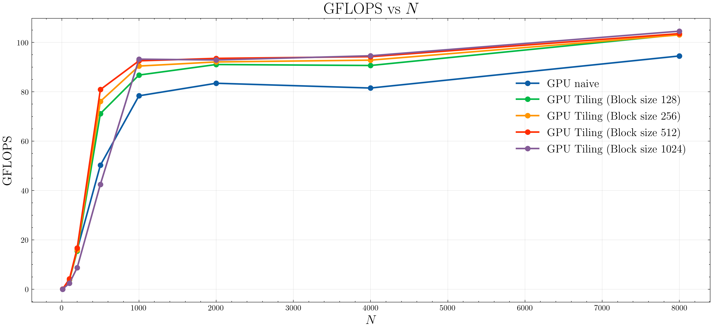

### Performance Summary

| Configuration | Avg GFLOPS | Gain |
| :--- | :---: | :---: |
| Naive (No Tiling) | 88.50 | - |
| Tiling (Block 128) | 94.96 | +7.3% |
| Tiling (Block 256) | 95.98 | +8.5% |
| Tiling (Block 512) | 97.10 | +9.7% |
| **Tiling (Block 1024)** | **97.34** | **+10.0%** |

</div>
<div>

<br>

<br>

<br>

### Analysis: Why only marginal gains?

Implementing tiling did not yield a dramatic performance increase, but this result is fully consistent with our bandwidth analysis.

* **The L2 Cache Factor:** As demonstrated, for $N=4000$ (and up to $\approx 16000$), the entire dataset fits within the GPU's **256 kB L2 Cache**.
* **Hardware vs. Software:** The hardware cache controller was already managing memory traffic efficiently and transparently.
* **Coalescing:** The naive implementation already benefited from coalesced memory access patterns.

</div>
</div>